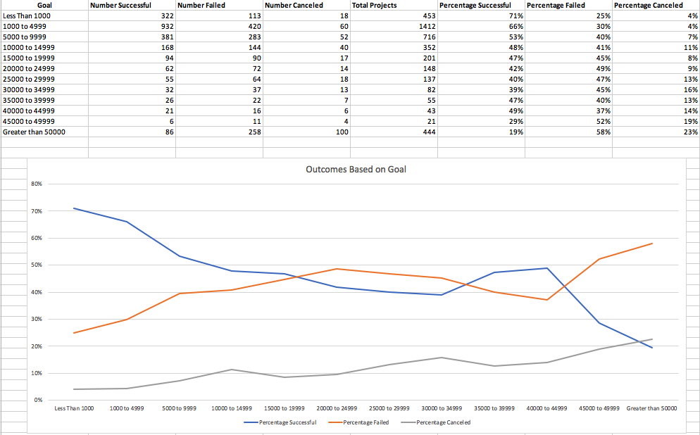

# Analyzing new start-ups success rate:

1. What are three conclusions we can make about Kickstarter Campaigns given the provided data?

Conclusion #1: The trend for startups has been increasing from 2009 to 2015.  We see the total startups company were dropped in 2016 compares to the previous periods. (Starters Count Digram)

Conclusion #2: Most of the startups data is collected in the U.S. and U.K.  It indicates the result in the dataset is mainly focus on the startups activities in the two countries. (Starters Count by Country)  It is also match with the total funding in each country.  (Funding by Country)

Conclusion #3: "Music", "Film & Video", and "Theater" industries are three most successfully funded categories in the data.  All three categories are well over 50% to achieve their goal for funding.  Journalism has 0% success rate in the data which indicate the industry is the worst industry to attrack funding.

Conclusion #4: The success rate in 2009 was about 60% and had increased in next three years (above 70%), then dropped below 60% since 2014.  This explains why the startups count drop in the year of 2016.  As more startups joining the industry, funding were diversified and became more competitive.  New entrepreneurs hesitate to enter the market after seeing the drop of success rate. (Success Rate by Year)

2. What are some of the limitations of this dataset?
Limitation 1: Data is mainly contributed from the U.S.  The data is a good representation about the U.S. startups trend, but not as global.

Limitation 2: Data demonstrates the success of startups mainly based on the capability to attract funding for their goal.  It does not indicate how well the company runs after drawing enough funding for the business plan.  As an entrepreneur, I can only see which industry or sub-category is more likely to get funding, but not how the business can survive.

Limitation 3: As an investor, I don't see what make a successful company in this data and how well my return in the future.

3. What are some other possible tables/graphs that we could create?
I have created "Starters Count", "Starters Count by Country", "Funding by Country", Success Rate by Category", and "Success Rate by Year" diagrams to support my conclusion in part I.
